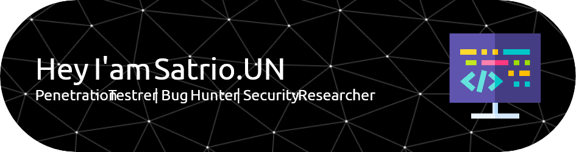

<!-- ## Hi Everyone, i'am Satrio Utomo Noerwahyu👋 -->

### 💫 About Me:
### Hi Everyone, i'am Satrio Utomo Noerwahyu👋 

### 🌐 Socials:
    

### 💻 Tech Stack:
                           

### 📊 GitHub Stats:
 
 

### 🏆 GitHub Trophies

### 🔝 Top Contributed Repo

---

###

Play Games With Me

###

###

<picture>
  <source media="(prefers-color-scheme: dark)" srcset="https://raw.githubusercontent.com/SatrioUN/SatrioUN/output/pacman-contribution-graph-dark.svg">
  <source media="(prefers-color-scheme: light)" srcset="https://raw.githubusercontent.com/SatrioUN/SatrioUN/output/pacman-contribution-graph.svg">
  
</picture>

###
